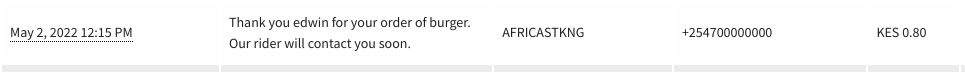

# Ordering

Golang REST API

## Features

- [ x ] Github Actions CI (unit tests) with branch protection
- [ x ] Africa's Talking SMS gateway (message sent to customer when order is created)
- [ x ] Gin router

## Run locally

Clone repo 

```
git clone https://github.com/EdwinWalela/ordering
```

Get dependancies

```
go mod tidy
```
Create `.env` file
```
PORT=
DB_URL=
AT_KEY= # Africa's talking APIKEY
AT_ENV=sandbox
AT_USER=sandbox
```

Start service

```
go run main.go
```

## User creation

In order to use the service, first create a user using the [frontend application](https://github.com/EdwinWalela/ordering-ui)

## Endpoints

### GET /customers

Created via Github OAuth Flow from the frontend application

response body

```json
{
  "customers": [
    {
      "id": 1,
      "name": "Edwin Walela",
      "code": "5cc44975-d10d-4b1b-9de2-33e35ec6f686"
    }
  ]
}
```

### POST /orders

Create an order. A demo SMS will be sent to the user. This can be viewed from the Africa's Talking Bulk SMS outbox dashboard

request body

```json
{
    "item":"Burger",
    "amount":500,
    "customer_id":1
}

```

<center>

</center>


### GET /orders

Retrieve all orders.

response body

```json
{
    "orders": [
        {
            "id": 1,
            "item": "Burger",
            "amount": 500,
            "customer_id": 1,
            "time": "2022-05-02T17:43:23.974821Z"
        }
    ]
}
```